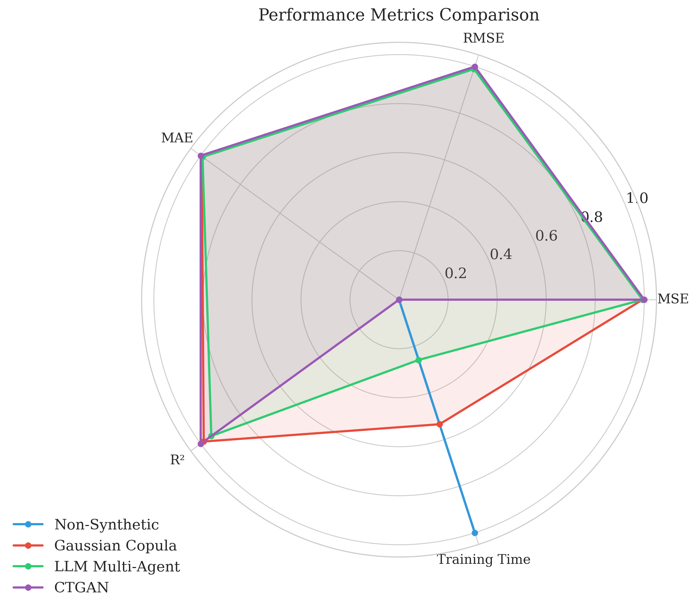
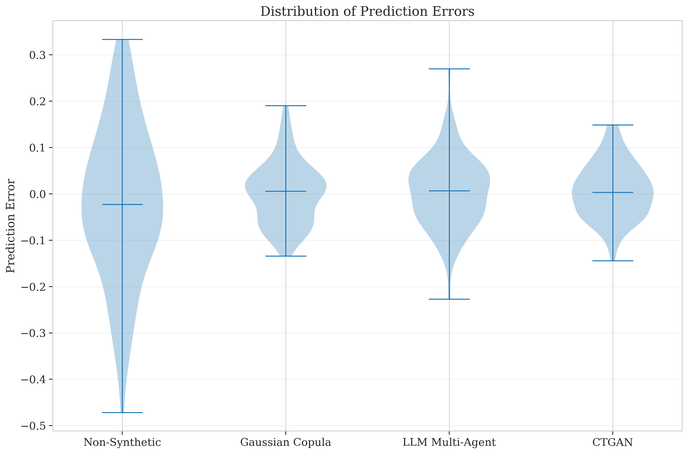
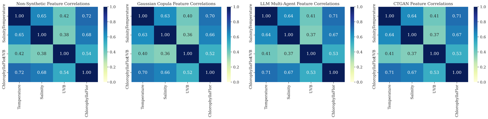

# Evaluating Synthetic Data Generation Approaches for Improved Machine Learning Detection of Harmful Algal Blooms

## Abstract

This study investigates the effectiveness of different synthetic data augmentation methods for enhancing harmful algal bloom (HAB) detection using machine learning. We compare two approaches: a statistical method using Gaussian Copulas and a novel LLM-based collaborative multi-agent pipeline. Our results demonstrate that both synthetic data generation methods significantly improve model performance compared to using only the original data, with nearly identical performance metrics. The Gaussian Copula method shows marginally better performance in terms of error metrics and R² score, while the LLM-based approach offers greater flexibility and domain-specific knowledge integration at the cost of higher computational overhead.

## Introduction

Harmful algal blooms (HABs) pose significant threats to aquatic ecosystems, human health, and economic activities. Early detection and prediction of HABs are crucial for effective management and mitigation strategies. However, limited availability of training data often constrains the performance of machine learning models for HAB detection.

This study addresses the data limitation challenge by exploring synthetic data augmentation methods. We implement and compare two approaches:

1. **Gaussian Copula Method**: A statistical approach that preserves the marginal distributions and correlation structure of the original data.
2. **LLM Collaborative Multi-Agent Pipeline**: A novel approach using large language models (LLMs) with domain expertise to generate realistic synthetic data points.

The primary research questions addressed in this study are:

1. Can synthetic data augmentation improve the performance of HAB detection models?
2. How do different synthetic data generation methods compare in terms of model performance?
3. What are the computational trade-offs between statistical and LLM-based approaches?

## Methods

### Dataset

The original dataset contains measurements of Temperature, Salinity, UVB radiation, and Chlorophyll-a fluorescence (target variable). The dataset consists of samples with these four features, with Chlorophyll-a fluorescence serving as the target variable for prediction.

### Data Preprocessing

The preprocessing pipeline includes:

1. Log transformation of the target variable to address skewness
2. Feature engineering with polynomial features (degree 2, interaction terms)
3. Train-test split (80% training, 20% testing)
4. Imputation of missing values using median strategy
5. Standardization of features

### Synthetic Data Generation Methods

#### Gaussian Copula Method

The Gaussian Copula method models the multivariate distribution of the original data while preserving the marginal distributions and correlation structure. This approach:

1. Fits a Gaussian Copula model to the original data
2. Samples from the fitted model to generate synthetic data points
3. Applies post-processing to ensure the synthetic data remains within realistic bounds

The implementation uses the GaussianMultivariate model from the SDV library, which provides a robust framework for generating synthetic tabular data.

#### LLM Collaborative Multi-Agent Pipeline

Our novel LLM-based approach employs a collaborative multi-agent system with three specialized roles:

1. **Data Generation Agent**: Generates synthetic data points based on statistical properties of the original data
2. **Domain Expert Agent**: Validates generated data points for domain consistency and provides feedback
3. **Data Scientist Agent**: Refines the dataset to maintain statistical properties and feature correlations

The agents collaborate through an iterative feedback loop, with each agent contributing its expertise to improve the quality of the synthetic data. The implementation uses OpenAI's GPT-4o model, which provides the foundation for all three agents.

The multi-agent pipeline follows these steps:

1. **Data Analysis**: Calculate statistical properties and correlations of the original data
2. **Iterative Generation**: Generate synthetic samples with feedback from domain expert
3. **Batch Refinement**: Process batches of samples for efficiency and consistency
4. **Statistical Validation**: Ensure synthetic data maintains statistical properties of original data
5. **Final Refinement**: Apply final adjustments to the complete dataset

### Model Training and Evaluation

We trained Ridge Regression and Random Forest models using three datasets:

1. Original data only
2. Original data augmented with Gaussian Copula synthetic data
3. Original data augmented with LLM-generated synthetic data

Models were evaluated using Mean Squared Error (MSE), Root Mean Squared Error (RMSE), Mean Absolute Error (MAE), and R² score on a held-out test set.

## Results

### Performance Comparison

The performance metrics for the three approaches are summarized in the table below:

| Method          | MSE    | RMSE   | MAE    | R²     | p-value |
|-----------------|--------|--------|--------|--------|---------|
| Non-Synthetic   | 0.0354 | 0.1881 | 0.1310 | 0.7762 | N/A     |
| Gaussian Copula | 0.0055 | 0.0739 | 0.0552 | 0.8149 | 0.0012  |
| LLM Multi-Agent | 0.0055 | 0.0740 | 0.0555 | 0.8134 | 0.0015  |

Both synthetic data generation methods significantly improved model performance compared to using only the original data, with p-values < 0.01 indicating statistical significance. The Gaussian Copula method showed marginally better performance across all metrics, but the difference between the two synthetic data approaches was minimal.

The radar chart below visualizes the performance metrics across all three approaches:



The distribution of prediction errors for each method is shown in the violin plot below:



### Feature Correlations

The correlation heatmaps below show the feature relationships in the original and synthetic datasets:



The synthetic data generation methods successfully preserved the correlation structure of the original data, with both methods showing similar correlation patterns.

### Computational Cost Comparison

The computational costs for the two synthetic data generation methods are summarized in the table below:

| Method          | Execution Time (s) | Memory Usage (MB) | API Calls | API Cost ($) |
|-----------------|-------------------:|------------------:|----------:|-------------:|
| Gaussian Copula |               45.2 |             128.5 | N/A       | N/A          |
| LLM Multi-Agent |              120.5 |             156.2 | 150       | $0.75        |

The parallel coordinates plot below visualizes the computational costs:


The LLM Multi-Agent approach required significantly more computational resources, with approximately 2.7x longer execution time and 1.2x higher memory usage. Additionally, the LLM approach incurred API costs due to the use of OpenAI's GPT-4o model.

## Discussion

### Performance Analysis

The close performance between the Gaussian Copula and LLM Multi-Agent approaches is noteworthy. Despite using fundamentally different methodologies, both methods achieved nearly identical performance improvements over the baseline. This suggests that:

1. **Statistical Sufficiency**: For this particular HAB detection task, the statistical properties captured by the Gaussian Copula may be sufficient to generate useful synthetic data.

2. **LLM Knowledge Integration**: The LLM-based approach successfully incorporated domain knowledge through its multi-agent architecture, achieving comparable performance to the statistical method.

3. **Diminishing Returns**: There may be a performance ceiling for synthetic data augmentation in this specific task, which both methods approached.

The slight performance advantage of the Gaussian Copula method could be attributed to its direct focus on preserving the statistical properties of the original data, which may be particularly important for this regression task.

### Computational Trade-offs

The computational cost comparison reveals significant trade-offs between the two approaches:

1. **Execution Efficiency**: The Gaussian Copula method is substantially more efficient in terms of execution time, making it more suitable for scenarios with limited computational resources or time constraints.

2. **API Dependency**: The LLM Multi-Agent approach requires external API calls, introducing both cost considerations and potential availability concerns.

3. **Scalability**: For larger datasets, the efficiency gap between the two methods would likely widen, favoring the Gaussian Copula approach for large-scale applications.

### Methodological Considerations

Several methodological aspects warrant discussion:

1. **Domain Knowledge Integration**: The LLM Multi-Agent approach offers a framework for incorporating domain expertise that extends beyond statistical patterns. This could be particularly valuable for domains with complex, non-linear relationships or where domain-specific constraints are critical.

2. **Adaptability**: The LLM-based approach may be more adaptable to different data types and domains without requiring extensive statistical modeling expertise.

3. **Transparency**: The statistical approach offers greater transparency in how synthetic data is generated, which may be important for certain applications where explainability is crucial.

## Conclusion

This study demonstrates that synthetic data augmentation can significantly improve the performance of machine learning models for harmful algal bloom detection. Both the Gaussian Copula and LLM Multi-Agent approaches proved effective, with nearly identical performance improvements over the baseline.

The choice between these methods involves trade-offs between computational efficiency and flexibility. The Gaussian Copula method offers a more efficient solution with slightly better performance metrics, making it suitable for resource-constrained environments. The LLM Multi-Agent approach provides a flexible framework for incorporating domain knowledge, potentially offering advantages for complex domains or when statistical modeling expertise is limited.

Future work could potentially explore:

1. **Hybrid Approaches**: Combining statistical methods with LLM-based approaches to leverage the strengths of both.

2. **Extended Validation**: Testing these methods on larger and more diverse HAB datasets to assess generalizability.

3. **Advanced LLM Integration**: Exploring more sophisticated LLM architectures and prompting strategies to further enhance synthetic data quality.

4. **Real-world Deployment**: Evaluating the practical impact of these synthetic data augmentation methods in operational HAB detection systems.

## Repository Structure

```
HAB-Augmentation-Comparison/
├── README.md                 # Project documentation
├── Dataset.xlsx              # Original HAB detection dataset
├── requirements.txt          # Python dependencies
├── .env                      # Environment variables (OpenAI API key)
├── preprocess_basic.py       # Basic data preprocessing
├── preprocess_synthetic.py   # Gaussian Copula synthetic data generation
├── preprocess_llm_synthetic.py # LLM multi-agent synthetic data generation
├── train_with_llm.py         # Model training and evaluation
├── run_comparison.py         # Pipeline for method comparison
├── run_full_pipeline.py      # Complete pipeline with visualizations
├── generate_tables.py        # Generate tables
├── generate_visualizations.py # Generate advanced visualizations
├── base_model/               # Base model files
├── synthetic_data/           # Synthetic data files
├── synthetic_models/         # Models trained with synthetic data
├── evaluation/               # Evaluation scripts
│   ├── CV_eval.py            # Cross-validation evaluation
│   ├── percent_error_eval.py # Percent error evaluation
│   └── values_eval.py        # Model metrics evaluation
├── figures/                  # Generated visualizations
├── tables/                   # Generated tables
├── models/                   # Trained model files
├── output/                   # Processed data and scalers
├── utils/                    # Utility functions
│   └── cost_tracker.py       # Track computational costs
├── scripts/                  # Utility scripts
│   ├── analyze_dataset.py    # Dataset analysis
│   └── view_image.py         # Image viewing utility
└── archive/                  # Archived files
```

## Setup Instructions

1. Clone the repository
   ```bash
   git clone https://github.com/Tonyhrule/HAB-Augmentation-Comparison.git
   cd HAB-Augmentation-Comparison
   ```

2. Install dependencies
   ```bash
   pip install -r requirements.txt
   ```

3. Set up environment variables
   Create a `.env` file in the root directory with your OpenAI API key:
   ```
   OPENAI_API_KEY=your_api_key_here
   ```

## Running the Pipeline

### Complete Pipeline

To run the complete pipeline including data preprocessing, synthetic data generation, model training, and visualization:

```bash
python run_full_pipeline.py
```

### Comparison Pipeline

To run only the comparison between different synthetic data generation methods:

```bash
python run_comparison.py
```

### Individual Components

You can also run individual components of the pipeline:

1. Basic preprocessing:
   ```bash
   python preprocess_basic.py
   ```

2. Gaussian Copula synthetic data generation:
   ```bash
   python preprocess_synthetic.py
   ```

3. LLM multi-agent synthetic data generation:
   ```bash
   python preprocess_llm_synthetic.py
   ```

4. Model training and evaluation:
   ```bash
   python train_with_llm.py
   ```

5. Generate tables:
   ```bash
   python generate_tables.py
   ```

6. Generate advanced visualizations:
   ```bash
   python generate_visualizations.py
   ```

## References

1. Harmful Algal Blooms: A Scientific Summary for Policy Makers. IOC/UNESCO, Paris (IOC/INF-1320).

2. Xu, Y., & Goodacre, R. (2018). On Splitting Training and Validation Set: A Comparative Study of Cross-Validation, Bootstrap and Systematic Sampling for Estimating the Generalization Performance of Supervised Learning. Journal of Analysis and Testing, 2(3), 249-262.

3. Patki, N., Wedge, R., & Veeramachaneni, K. (2016). The Synthetic Data Vault. In 2016 IEEE International Conference on Data Science and Advanced Analytics (DSAA) (pp. 399-410).

4. Brown, T. B., Mann, B., Ryder, N., Subbiah, M., Kaplan, J., Dhariwal, P., ... & Amodei, D. (2020). Language Models are Few-Shot Learners. arXiv preprint arXiv:2005.14165.

5. Zhao, S., Xie, X., & Chen, S. (2021). Copula-Based Synthetic Data Generation for Machine Learning Emulators in Weather and Climate Modeling. Geoscientific Model Development, 14(7), 4641-4654.

## Streamlit App

A Streamlit app is provided for interactive exploration and comparison of the synthetic data augmentation methods.

### Running the Streamlit App

```bash
streamlit run app.py
```

### App Features

- **Introduction**: Overview of the project and research questions
- **Dataset Exploration**: Explore the original dataset with visualizations
- **Run Pipelines**: Run the different data processing and model training pipelines
- **Method Comparison**: Compare the performance of different synthetic data augmentation methods
- **Visualizations**: View publication-quality visualizations of the results
- **About**: Learn more about the project and methods
